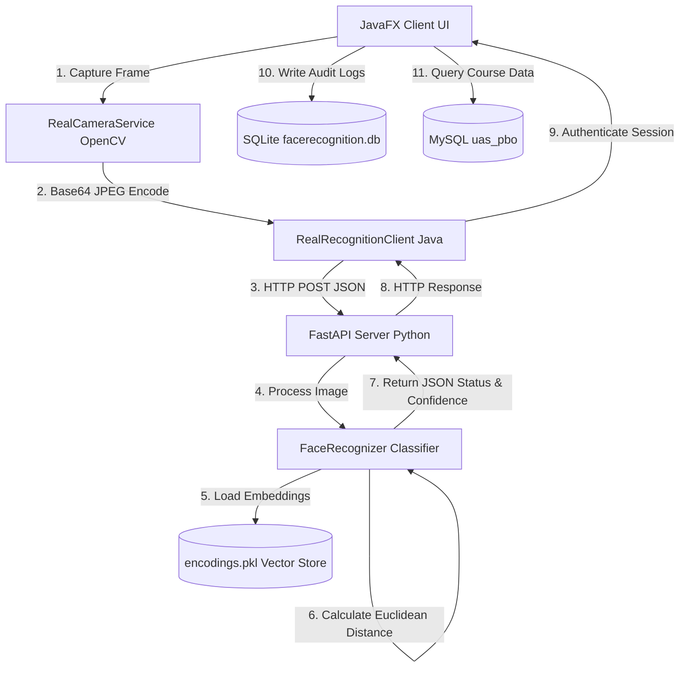

# CASE STUDY PORTFOLIO: Nusa LMS dengan Face Recognition Login
### *Integrasi Deep Metric Learning & RESTful API untuk Sistem Autentikasi Pengguna*

Proyek ini adalah sistem **Learning Management System (LMS)** berbasis desktop yang mengintegrasikan kecerdasan buatan (**Computer Vision & Deep Learning**) sebagai metode autentikasi utama (*passwordless login*). Sistem ini mengadopsi arsitektur *hybrid* yang memisahkan aplikasi frontend desktop (**JavaFX + OpenCV**) dengan backend pemrosesan kecerdasan buatan (**Python FastAPI + Dlib ResNet-34**).

Berikut adalah dokumentasi teknis mendalam yang dirancang khusus untuk kebutuhan portfolio di bidang **Machine Learning, Deep Learning, dan Data Science**, dengan fokus utama pada pemodelan *Face Recognition*.

---

## 1. Ikhtisar Arsitektur Sistem (System Architecture)

Sistem ini didesain dengan konsep *Separation of Concerns* (SoC) dan *Microservices* sederhana guna menjamin modularitas dan kemudahan skalabilitas:



### Komponen Utama:
1. **Frontend Desktop (JavaFX)**: Menangani antarmuka pengguna, *rendering* kamera menggunakan OpenCV Java *wrapper*, *base64 encoding* gambar, serta manajemen sesi pengguna.
2. **Database Transaksional (MySQL)**: Menyimpan data relasional LMS seperti `mahasiswa`, `mata_kuliah`, `jadwal`, dan `tugas`.
3. **Database Audit (SQLite)**: Menyimpan log kehadiran (`attendance_logs`) secara lokal termasuk status autentikasi dan tingkat kepercayaan (*confidence score*).
4. **Backend AI (Python FastAPI)**: Menyediakan layanan pemrosesan citra, ekstraksi wajah (*facial embeddings*), klasifikasi kedekatan vektor (*vector similarity classification*), dan pendaftaran wajah baru (*enrollment*).

---

## 2. Pemodelan Face Recognition: Teori & Pipeline Machine Learning

Sistem pengenalan wajah pada proyek ini menggunakan pendekatan **Deep Metric Learning** dengan ekstraksi representasi wajah ke dalam ruang vektor berdimensi tinggi. Alur pemrosesan dari gambar mentah hingga hasil pengenalan dijelaskan di bawah ini:

### 2.1 Preprocessing: Rotasi EXIF & Normalisasi Citra
Pada implementasi praktis, kamera perangkat sering kali menghasilkan metadata orientasi (EXIF) yang berbeda-beda (misalnya rotasi 90°, 180°, atau 270° tergantung posisi fisik kamera). Jika gambar mentah langsung dikirim ke model pendeteksi wajah, koordinat wajah akan terdistorsi dan deteksi akan gagal.

Fungsi `fix_exif_rotation` dalam `encode_faces.py` membaca metadata EXIF dan memutar matriks gambar secara dinamis sebelum masuk ke tahap inferensi:
* **EXIF 3**: Rotasi $180^\circ$
* **EXIF 6**: Rotasi $270^\circ$ (berlawanan jarum jam)
* **EXIF 8**: Rotasi $90^\circ$ (searah jarum jam)

Setelah orientasi diperbaiki, citra dikonversi menjadi representasi array NumPy RGB dengan 3 saluran warna.

---

### 2.2 Face Detection (Deteksi Lokasi Wajah)
Deteksi wajah dilakukan untuk memotong koordinat bounding box wajah $(y_1, x_2, y_2, x_1)$ dari background. Model ini menggunakan pustaka `face_recognition` yang menawarkan dua opsi deteksi:
1. **HOG + Linear SVM (Default)**: Cepat, efisien pada CPU. Menggunakan fitur *Histogram of Oriented Gradients* untuk mendeteksi tepi dan sudut, diikuti oleh klasifikasi biner SVM untuk menentukan daerah wajah.
2. **CNN (Max-Margin Object Detection - MMOD)**: Sangat akurat, lebih toleran terhadap orientasi wajah non-frontal, namun membutuhkan akselerasi GPU (CUDA) agar dapat berjalan secara *real-time*.

---

### 2.3 Facial Landmark & Face Alignment
Sebelum wajah di-encode, dlib melakukan estimasi **68 Landmark Wajah** (*Facial Landmarks*). Titik landmark ini digunakan untuk mendeteksi mata, hidung, bibir, dan rahang. 
* **Face Alignment**: Berdasarkan koordinat mata dan hidung, gambar diputar dan diskalakan secara geometris agar mata berada pada posisi horizontal yang sejajar. Hal ini penting untuk memastikan ekstraksi fitur tidak sensitif terhadap sudut kemiringan kepala (*roll*, *pitch*, *yaw*).

---

### 2.4 Feature Extraction: Dlib ResNet-34 (Deep Learning Core)
Ekstraksi fitur adalah jantung dari sistem ini. Model menggunakan arsitektur **Residual Network dengan 34 layer (ResNet-34)** yang telah dilatih menggunakan metode **Triplet Loss** pada dataset berskala besar (lebih dari 3 juta gambar wajah).

```
[Gambar Wajah Aligned] ---> [ResNet-34 Model] ---> [128-Dimensional Embedding Vector]
```

* **Output Model**: Sebuah vektor berdimensi 128 (128-D float vector) yang mempresentasikan karakteristik geometris dan tekstur wajah unik manusia.
* **Triplet Loss Concept**: Selama masa *training*, model dilatih untuk meminimalkan jarak Euclidean antara vektor gambar jangkar (*anchor*) dan gambar orang yang sama (*positive*), sekaligus memaksimalkan jarak antara gambar jangkar dan gambar orang yang berbeda (*negative*).
  $$\mathcal{L} = \max \left( 0, \|f(x_i^a) - f(x_i^p)\|_2^2 - \|f(x_i^a) - f(x_i^n)\|_2^2 + \alpha \right)$$
  Di mana:
  * $x_i^a$ adalah wajah *anchor* (target).
  * $x_i^p$ adalah wajah *positive* (orang yang sama dengan anchor).
  * $x_i^n$ adalah wajah *negative* (orang berbeda).
  * $\alpha$ adalah margin pemisahan.

---

### 2.5 Face Matching: Kedekatan Kosinus & Jarak Euclidean (Metric Learning)
Untuk mengenali wajah yang masuk saat login (`/recognize`), sistem tidak perlu melakukan pelatihan ulang (*retraining*) model Deep Learning. Model ini menggunakan pendekatan **One-Shot Learning** (atau *Few-Shot* jika memiliki beberapa gambar per orang).

1. **Euclidean Distance Calculation**: 
   Sistem menghitung jarak L2 (Euclidean) antara vektor wajah input ($v_{input}$) dengan seluruh pustaka vektor terdaftar ($v_{dataset}$) yang tersimpan di database `encodings.pkl`:
   $$d(v_1, v_2) = \sqrt{\sum_{i=1}^{128} (v_{1,i} - v_{2,i})^2}$$
   
2. **Decision Rule (Thresholding)**:
   * Batas toleransi ditetapkan pada `TOLERANCE = 0.6`. Jarak yang lebih kecil menunjukkan kemiripan yang lebih tinggi.
   * Indeks dengan jarak terkecil dipilih menggunakan `np.argmin(distances)`.
   * Jika jarak terkecil $\le 0.6$, wajah diklasifikasikan sebagai nama pemilik vektor tersebut (`status: "recognized"`).
   * Jika jarak terkecil $> 0.6$, sistem menganggap wajah tersebut tidak dikenal (`status: "unknown"`).

3. **Confidence Score Calculation**:
   Tingkat kepercayaan dihitung dengan formula linier terbalik terhadap jarak Euclidean:
   $$\text{Confidence} = 1.0 - \text{Distance}$$
   Hasil dibulatkan ke dua angka di belakang desimal. Jika jarak adalah $0.13$, tingkat kepercayaan adalah $0.87$ ($87\%$).

---

## 3. Bedah Kode Sumber (Code Walkthrough)

### 3.1 `encode_faces.py` (Proses Offline Training / Encoding)
File ini bertanggung jawab membaca data folder mentah pada direktori `dataset/`, melakukan deteksi wajah, mengonversinya menjadi 128-D embedding, lalu mem-pickle hasilnya ke dalam berkas biner `encodings.pkl`.

```python
# Potongan logika inti dari encode_faces.py
for name in os.listdir(DATASET_PATH):
    person_folder = os.path.join(DATASET_PATH, name)
    if not os.path.isdir(person_folder):
        continue
    
    for filename in os.listdir(person_folder):
        filepath = os.path.join(person_folder, filename)
        
        # Perbaikan rotasi gambar berdasarkan metadata EXIF
        image = fix_exif_rotation(filepath)
        
        # Deteksi koordinat wajah
        locations = face_recognition.face_locations(image)
        
        # Ekstraksi 128-D embeddings
        encodings = face_recognition.face_encodings(image, locations)
        
        if len(encodings) == 0:
            continue
        
        # Simpan nama dan representasi vektor wajah pertama yang terdeteksi
        data["names"].append(name)
        data["encodings"].append(encodings[0])

# Serialisasi ke file pkl
with open(ENCODINGS_PATH, "wb") as f:
    pickle.dump(data, f)
```

---

### 3.2 `recognizer.py` (Engine Klasifikasi Real-time & Dynamic Enrollment)
Kelas `FaceRecognizer` mengimplementasikan thread-safe mechanism menggunakan `threading.Lock()` untuk mencegah konflik saat beberapa request mengakses berkas `encodings.pkl` secara bersamaan, terutama saat pendaftaran wajah baru (*enrollment*).

```python
class FaceRecognizer:
    def __init__(self):
        self._lock = threading.Lock()
        self._data = self._load_encodings()

    def recognize(self, base64_image: str):
        with self._lock:
            img_array = self._base64_to_image(base64_image)
            if img_array is None:
                return {"status": "unknown", "name": None, "confidence": 0.0}
            
            face_locations = face_recognition.face_locations(img_array)
            if not face_locations:
                return {"status": "unknown", "name": None, "confidence": 0.0}

            face_encodings = face_recognition.face_encodings(img_array, face_locations)

            for face_encoding in face_encodings:
                # Menghitung jarak Euclidean ke seluruh database embeddings
                distances = face_recognition.face_distance(
                    self._data["encodings"], face_encoding
                )

                if len(distances) == 0:
                    continue

                best_match_index = np.argmin(distances)
                best_distance = distances[best_match_index]
                confidence = round(1 - float(best_distance), 2)

                # thresholding
                if best_distance <= TOLERANCE:
                    name = self._data["names"][best_match_index]
                    return {"status": "recognized", "name": name, "confidence": confidence}

            return {"status": "unknown", "name": None, "confidence": round(confidence, 2)}

    def enroll(self, name: str, base64_image: str):
        with self._lock:
            img_array = self._base64_to_image(base64_image)
            face_locations = face_recognition.face_locations(img_array)

            if not face_locations:
                return {"status": "error", "message": "Tidak ada wajah terdeteksi"}

            # Ambil encoding wajah pertama
            face_encoding = face_recognition.face_encodings(img_array, face_locations)[0]

            # Append data baru ke database in-memory
            self._data["names"].append(name)
            self._data["encodings"].append(face_encoding)

            # Simpan langsung ke file encodings.pkl agar persisten
            with open(ENCODINGS_PATH, "wb") as f:
                pickle.dump(self._data, f)

            return {"status": "enrolled", "name": name}
```

---

## 4. Aliran Data & Integrasi Database (Data Science Perspective)

Dari kacamata Data Science, proyek ini menggabungkan manajemen data tidak terstruktur (gambar wajah), representasi vektor (embeddings), log deret waktu (*time-series audit logs*), dan skema relasional transaksional.

### 4.1 Schema Database Audit (SQLite)
Audit log disimpan di SQLite (`facerecognition.db`) untuk mencatat performa model di dunia nyata serta data aktivitas user:

```sql
CREATE TABLE IF NOT EXISTS attendance_logs (
    log_id TEXT PRIMARY KEY,        -- UUID v4
    status TEXT NOT NULL,           -- 'recognized', 'unknown', 'enrolled'
    person_name TEXT,               -- Nama mahasiswa (NULL jika unknown)
    confidence REAL,                -- Confidence score (0.00 - 1.00)
    logged_at TEXT NOT NULL         -- Timestamp ISO-8601 (YYYY-MM-DDTHH:MM:SS)
);
```

**Analisis Metrik Keamanan & Keandalan**:
Dengan menyimpan `confidence` dan `status` secara berkala, tim Data Science dapat melakukan analisis pasca-penerapan (*post-deployment analysis*) untuk:
* Mengevaluasi tingkat kecocokan rata-rata (*mean confidence*).
* Melakukan penyetelan (*fine-tuning*) pada nilai `TOLERANCE` berdasarkan distribusi nilai jarak Euclidean dari wajah asing (deteksi *False Acceptance Rate* / FAR) versus wajah pemilik akun asli (*False Rejection Rate* / FRR).

---

## 5. Evaluasi Proyek & Potensi Pengembangan (Model Evaluation & Improvements)

Sebagai proyek portfolio yang matang, berikut adalah analisis kelebihan, limitasi model saat ini, dan solusi optimasi di masa depan:

### 5.1 Kelebihan
* **Zero-Retraining (Few-Shot Learning)**: Penambahan mahasiswa baru (`/enroll`) dapat dilakukan secara instan tanpa perlu melatih ulang seluruh arsitektur saraf ResNet-34.
* **Kecepatan Inferensi**: Pencarian kemiripan vektor sangat cepat karena menggunakan operasi matriks teroptimasi dari NumPy (`np.argmin`, Euclidean distance).
* **Robustness**: Model ResNet-34 sangat andal dalam mengenali wajah meski ada variasi pencahayaan sedang, kacamata, ekspresi mikro, atau kumis/jenggot tipis.

### 5.2 Limitasi Saat Ini
* **Pickle File Scalability**: Menyimpan ribuan vektor dalam file `.pkl` (pickle) kurang skalabel. Operasi baca-tulis file secara sinkron akan menyebabkan kemacetan (*bottleneck*) I/O saat jumlah mahasiswa mencapai ribuan.
* **Liveness Detection (Anti-Spoofing)**: Sistem belum dilengkapi deteksi keaktifan wajah. Seseorang dapat menipu sistem (*spoofing*) dengan menunjukkan foto mahasiswa target di depan kamera ponsel.
* **CPU Bottleneck**: Proses deteksi wajah (HOG) dan *embedding generation* pada CPU dapat mengalami penurunan FPS (*frames per second*) pada perangkat dengan spesifikasi rendah.

### 5.3 Rekomendasi Optimasi (Data Science Roadmap)
1. **Migrasi ke Vector Database**:
   Ganti file `encodings.pkl` dengan Vector Database khusus seperti **Milvus**, **Qdrant**, atau **FAISS (Facebook AI Similarity Search)**. Teknologi ini menggunakan indeks ANN (*Approximate Nearest Neighbor*) untuk pencarian vektor berskala jutaan dengan latensi sub-milidetik.
2. **Implementasi Anti-Spoofing (Liveness Detection)**:
   Tambahkan model Deep Learning klasifikasi biner ringan (misalnya MiniFASNet atau MobileNetV3) untuk memprediksi apakah input kamera berupa wajah asli 3D atau gambar cetak 2D/layar digital. Pendekatan lain adalah mendeteksi kedipan mata (*blink detection*) menggunakan rasio aspek mata (*Eye Aspect Ratio* - EAR) dari koordinat landmark wajah dlib.
3. **Peningkatan Model ke FaceNet / ArcFace**:
   Ganti pustaka dlib dengan arsitektur modern seperti **ArcFace** atau **FaceNet** yang menghasilkan embedding dengan pemisahan margin sudut (*angular margin*) yang lebih ketat, guna menurunkan *False Acceptance Rate* (FAR) secara signifikan pada dataset besar.
4. **Quantization & Edge Deployment**:
   Lakukan kuantisasi model Deep Learning (misalnya dari format FP32 ke INT8) menggunakan ONNX Runtime atau TensorFlow Lite untuk mempercepat kecepatan inferensi di perangkat CPU/Edge Client.

---

## 6. Kesimpulan Portfolio
Proyek **Nusa LMS** mendemonstrasikan integrasi sukses antara rekayasa perangkat lunak tradisional (Java OOP, REST API, SQLite/MySQL) dengan kecerdasan buatan modern (Deep Metric Learning). Penerapan pipeline pemrosesan wajah dari *image alignment*, ekstraksi fitur vektor berdimensi tinggi, hingga klasifikasi berbasis metrik jarak membuktikan pemahaman ujung-ke-ujung (*end-to-end*) dalam membangun solusi Machine Learning yang siap pakai (*production-ready*).
